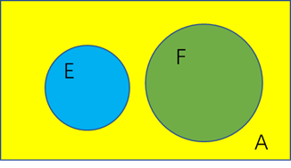

# 随机事件及概率

## 测度

### $\sigma$代数

定义在集合$X$上的。

$X$为一集合，假设有子集族$\mathcal{F} \subseteq \mathcal{P} ( X) ( \mathcal{P} ( X) $ 代表 $X$ 的**幂集**) 满足下列条件$^{[1][2]}$
1. $X\in\mathcal{F}\text{（这里也就是保证了}\emptyset\in \mathcal{F}\text{）}$
1. $(\forall F\in\mathcal{F})\left[(F\in\mathcal{F})\Rightarrow(X-F\in\mathcal{F})\right]\text{（对补集封闭）}$
 3. $(\forall\mathcal{A})\left\{[(\mathcal{A}\cong\mathbb{N})\land(\mathcal{A}\subseteq\mathcal{F})]\Rightarrow\left(\bigcup\mathcal{A}\in\mathcal{F}\right)\right\}\text{（如果有可数个集合 }A_1,A_2,\cdots\text{ 都在 }\mathcal{F}\text{ 中,那么它们的并集也在}\mathcal{F}\text{ 中）}$

则称 $\mathcal{F}$ 是 $X$ 的一个 $\sigma$-代数，

在测度论里有序对 $(X,\mathcal{F})$ 会被称为一个**可测空间**。而任何在 $F$ 中的子集 $A$, 则称为**可测集合** (measurable set); 

而在**概率论**中，$\mathcal{F}$ 被称为**事件族** (family of events) , $\mathcal{F}$ 中的子集 $A$ 则称为**事件**。

### 测度定义

设$X$是一个集合，$\Sigma$ 是一个$\sigma$代数，若函数 $\mu:\Sigma\to[0,\infty)$ 若满足：

* $\mu(\varnothing)=0$ (空集合的测度为零)

* 可数可加性( $\sigma$-可加性): 

  若集合序列 $\{E_n\in\Sigma\}_{n\in\mathbb{N}}$ 对所有不相等正整数 $i\neq j$ 都有：

  $E_i\cap E_j=\varnothing$,则$\mu\left(\bigcup_{n\in\mathbb{N}}E_n\right)=\sum_{n=1}^\infty\mu(E_n)$

 那$\mu$ 被称为定义在 $\Sigma$ 上的一个非负测度，或简称为测度。为了叙述简便起见，也可称 $(X,\Sigma,\mu)$ 为一测度空间。

### 从测度到概率

概率是一种测度。

前文已经说到：

> 而在**概率论**中，$\mathcal{F}$ 被称为**事件族** (family of events) , $\mathcal{F}$ 中的子集 $A$ 则称为**事件**。

类比的，样本空间$\Omega$对应于前文的集合$X$，事件族$\mathcal{F}$是$\Omega$的$\sigma$-代数。

函数$P(\mathcal{F})$ 是事件到实数的一个映射，并且满足一下公理。

#### 非负性

$$
\forall A\in\mathcal{F},P(A)>0
$$

#### 归一性

$$
P(\Omega)=1
$$

#### 可加性

任意两两不相交事件$E_1,E_2,\ldots$的**可数**序列满足
$$
P(E_1\cup E_2\cup\cdots)=\sum P(E_i)
$$
对应于测度中的$\sigma$可加性。

则$P(A)$称为事件$A$的概率。

#### 其他性质

* 可减性：

  如果$B\supset A$，则：
  $$
  P(B-A)=P(B)-P(A)
  $$

* $P(\bar{A})=1-P(A)$

* 加法公式（容斥原理）：
  $$
  P(\bigcup_i^n A_i)=\sum_{1\leq i\leq n}P(A_i)-\sum_{1\leq i < j\leq n}P(A_iA_j)+\cdots+(-1)^{n-1}P(A_1A_2\cdots A_n)
  $$

* [x] **下连续性与上连续性**：由无穷导致的。

## 条件概率

### 定义

设$(\Omega,\mathcal{F},P)$是一个概率空间，设$A\in\mathcal{F}$，并且$P(A)>0$，则对于任意的$B\in\mathbf{F}$，记：
$$
P(B|A)=\frac{P(AB)}{P(A)}
$$
$P(B|A)$为事件$A$发生的前提下，事件$B$发生的**条件概率**。

**条件概率满足概率公理。**

### 乘法公式

$$
P(A_1A_2\ldots A_n)=P(A_1)P(A_2|A_1)P(A_3|A_1A_2)\cdots P(A_n|A_1A_2\ldots A_{n-1})
$$

### 答题

> 设$A_1$={“事件描述”}，$A_2$={"事件描述"}。

在使用**可加性**之前，说明**事件互不相容**。

## 独立性

### 定义

若对概率空间中的两个事件 A, B, 有：
$$
P(AB)=P(A)P(B)
$$
 则称事件 A 与事件 B 是**相互独立**。否则称他们不相互独立，或相依的。

### 与**互不相容**区分

* **互不相容**讨论的是事件，可以理解为**定义域**。
* **独立**讨论的是实值，可以理解为**值域**。（但是归根结底也是独立）

* 需要注意！互不相容的事件（非空），相互间反而是不独立的。（如图）

* 若A、B互不相容，A补并B补事件是必然事件。

那么对**独立**事件的理解，就是**不受其他影响**，而不是没有关系。

### 其他性质

* 特别的，必然事件$\Omega$与不可能事件$\emptyset$与任何事件都独立。
* 任意独立
  * 需要证明$2^n-n-1$个等式成立。
  * 任意独立，可得两两独立；反之，不可。
  * $\text{两两独立}\subset \text{任意独立} $

## 全概率公式

### 完备事件集

定义：设$A_1,...,A_n$是一组事件，若它们两两互不相容，而且：
$$
\sum_{i=1}^n A_i=\Omega
$$
则称它们是样本空间的一个**分割**，亦称**完备事件组**。

### 全概率公式

全概率公式：对于$\Omega$的一个分割$A_1,...,A_n,P(A_i)>0$,有：
$$
\forall B\in\mathscr{F},P(B)=\sum_{i=1}^nP(B|A_i)
$$
**形式化的分类讨论**。

### 答题

**对样本空间进行合理的划分。**

> P26页例1.5.4

利用全概率公式需要，划分事件集，并声明“A_1A_2A_3..为**完备事件集**”，之后才能使用全概率公式。

## 贝叶斯公式

贝叶斯公式：对于概率空间$(\Omega,\mathscr{F},P)$，$A_1,A_2,...,A_n$是样本空间的一个分割，则对任意$B\in\mathscr{F}$，$P(B)>0$，有：
$$
P(A_k|B)=\frac{P(A_k)P(B|A_k)}{\sum_{j=1}^n P(A_j)P(B|A_j)},k=1,2,...,n
$$

## 伯努利概型

若试验$E_1$的任一结果（事件）都与试验$E_2$的任一结果（事件）相互独立，则称这**两个试验相互独立**。

若试验$E_1,...,E_n$相互独立，并且这$n$个独立实验相同，则称其为**n重重复试验**。

* n重伯努利试验中，事件A发生k次的概率：
  $$
  P_n(k)=C_n^kp^k(1-p)^{n-k},P(A)=p
  $$

# 随机变量及其分布

## 随机变量

### 定义

设$X(\omega)$是定义在概率空间$(\Omega,\mathscr{F},P)$上的单值实函数，即对每个$\omega\in\Omega$，都有$X(\omega)\in R$，并且对任意$x\in R$，$\{\omega|X(\omega)\leq x\}$都是随机事件，

即有：
$$
\{\omega|X(\omega)\leq x\}\in\mathscr{F}
$$
则称$X(\omega)$是概率空间上的**随机变量**。通常简记为$X$。

事件$\{\omega|X(\omega)\leq x\}$，简记为$\{X\leq x\}$

### 分布函数

分布函数：$X\sim F(x)=P(X\leq x)$。定理：

* 单调不减：$a<b\Rightarrow F(a)\leq F(b)$。
* $0\leq F(x)\leq 1,\lim_{n\rightarrow +\infin}F(x)=1,\lim_{n\rightarrow-\infin}F(x)=-1$。
* 右连续性：$F(x)$在任何点x处右连续。
  * 用$\bigcap\{X\leq x+\frac{1}{n}\}=\{X\leq x\}$和右极限$=\lim_{n\rightarrow\infin}F(x+\frac{1}{n})$来证明。

* [x] 为什么没有左连续性？因为**取等条件**

## 离散型随机变量

### 定义

设离散型随机变量X的所有可能取得值为$x_1,...,x_n$，而X取$x_k$的概率为$p_k$，即$P(X=x_k)=p_k(k=1,...,n)$。

称上式为随机变量X的**概率分布律**。

### 常见分布

#### 退化分布

$P(X=C)=1$

#### 两点分布

$P(X=0)=p,P(X=1)=1-p$

#### 二项分布

$P(X=k)=C_n^kp^k(1-p)^{n-k}$

当$(n+1)p$为整数时，在$k=(n+1)p,(n+1)p-1$处概率取得最大值。

若不为整数，则在$[(n+1)p]$取得最大值。

于是$[(n+1)p]$称为二项分布$B(n,p)$的**最可能出现次数**，或称**最可能值**。

* $E[X]=np,D(X)=np(1-p)$

#### 几何分布

$P(X=k)=(1-p)^{k-1}p$，记为$X\sim G(p)$。有$\sum_{i=1}^\infin P(X=k)=1$。

#### 超几何分布

$N$件产品中有$M$件次品，现抽$n$件出来，其中的次品数服从超几何分布：
$$
P(X=k)=\frac{C_M^kC_{N-M}^{n-k}}{C_N^n},k=1,..,min(n,M)
$$

### 柏松定理

设随机变量$X_n\sim B(n,p_n),(n=1,2,...)$。若有$\lim_{n\rightarrow\infin}np_n=\lambda$，则有：
$$
\lim_{n\rightarrow\infin}P(X_n=k)=\frac{\lambda^k}{k!}e^{-\lambda}
$$
记泊松分布为$X\sim P(\lambda)$：
$$
P(X=k)=\frac{\lambda^k}{k!}e^{-\lambda},k=0,1,2,...
$$
自然界很多稀疏现象都服从泊松分布，故其又称为**稀疏现象律**。泊松分布最可能值为$\lambda,\lambda -1$或$[\lambda]$。 

* $E[X]=\lambda,D(X)=\lambda$

### 答题

#### 求二项分布极值？

前后项**做比值**。

#### 注意审题

注意是求的**分布**F还是**分布律**P。

## 连续型随机变量

定义：设随机变量X的概率分布函数为$F(x)$，如果存在一个函数$f(x)$，对于任意实数x，都有：
$$
F(x)=\int_{-\infin}^xf(t)dt,x\in R
$$
则称X为**连续性随机变量**，$f(x)$为X的**概率密度函数**。

* 连续型随机变量有：$P(X=a)=0,P(a\leq X\leq b)=P(a<X\leq b)=P(a\leq X<b)=P(a<X<b)$。
* 一个事件概率为零，他并不一定是不可能事件（空集）。同样，概率为1的也不一定是必然事件。

### 常见分布

#### 均匀分布

$X\sim U[a,b]$：
$$
f(x)=\begin{cases}\frac{1}{b-a}&a\leq x\leq b\\0&else\end{cases}
$$

#### 指数分布

$X\sim E(\lambda)$:
$$
f(x)=\begin{cases}\lambda e^{-\lambda x}&x>0\\0&x\leq 0\end{cases}
$$

* 指数分布具有**无记忆性**：$P(X>s+t|X>s)=P(X>t)$。

* $E[X]=\frac{1}{\lambda},D(X)=\frac{1}{\lambda^2}$

#### 正态分布

$X\sim N(\mu,\sigma^2)$:
$$
f(x)=\frac{1}{\sqrt{2\pi}\sigma}e^{-\frac{(x-\mu)^2}{2\sigma^2}},x\in R
$$

* 标准正态分布的概率函数和分布函数记为$\varphi(x),\Phi(x)$。
* 有$\Phi(-x)=1-\Phi(x)$（关于y轴对称）。
* 3$\sigma$原则：正态分布几何全部的取值都落在$[\mu-3\sigma,\mu+3\sigma]$内。

#### 多元正态分布（缺了点）

如果 $\Sigma$是非奇异的，那么该分布可以由以下的概率密度函数来描述：

$$
f_\mathbf{x}(x_1,\ldots,x_k)=\frac1{\sqrt{(2\pi)^k|\boldsymbol{\Sigma}|}}\mathrm{e}^{-\frac12(\mathbf{x}-\boldsymbol{\mu})^\mathrm{T}\boldsymbol{\Sigma}^{-1}(\mathbf{x}-\boldsymbol{\mu})}
$$
 注意这里的$|\Sigma|$表示协方差矩阵的行列式。

从线性变换的角度理解：

设$X=(x_1,x_2,\cdots,x_n)^T$为各维度均独立的正态分布$\mathcal{N}(\mu,\sigma)$
$$
\begin{aligned}
f(x_1,x_2,\cdots,x_n)&=f(x_1)f(x_2)\cdots f(x_n)\\
										 &=\frac1{\sqrt{(2\pi)^k}\sigma^k}\mathrm{e}^{-\frac{(\mathbf{x}-\boldsymbol{\mu})^\mathrm{T}(\mathbf{x}-\boldsymbol{\mu})}{\sigma^k}}
\end{aligned}
$$
此时的协方差矩阵就是对角矩阵，且各个值均为$\sigma$。

做线性变换
$$
Y=AX+B
$$
此时将正态分布一般化。

## 随机变量函数的分布（？？？）

定理：设连续型随机变量$X$具有概率密度函数$f_X(x)$，其可能的取值范围为$(a,b)$（可以到无穷）。则：

* 若函数$y=g(x)$在区间$(a,b)$上严格单调，其反函数$x=g^{-1}(y)$有连续的导函数，则$Y=g(X)$也是连续型随机变量，其概率密度函数为：
  $$
  f_Y(y)=\begin{cases}f_X(g^{-1}(y))|(g^{-1})'(y)|& min(g(a),g(b))<y<max(g(a),b(b))\\0&else\end{cases}
  $$

* 若函数$y=g(x)$在区间$(a,b)$中不重叠的区间$I_1,...,I_n$上逐段严格单调，其反函数$h_1(y),...,h_n(y)$在段内均有连续导函数，则Y也是连续型随机变量：
  $$
  f_Y(y)=\sum_{i=1}^nf_X(h_i(y))|h_i'(y)|
  $$

# 多维随机变量及其分布

## 二维随机变量及其分布

### 定义

设$(X,Y)$是二位随机变量，对任意实数$x,y$，二元函数$ F(x,y)=P(X\leq x,Y\leq y)$称为随机变量$(X,Y)$的联合分布函数。
$$
F(x,y)=\int_{-\infin}^{x}\int_{-\infin}^yf(u,v)dudv
$$

* 特别地，如果二阶偏导数$f(x,y)$连续（即与求偏导顺序无关），则定义$f(x,y)=\frac{\partial^2F(x,y)}{\partial x\partial y}$为**联合密度函数**。
  * 二维正态分布
  * 二维均匀分布

## 边缘分布

>记二维随机变量的分布函数$F(x,y)$关于$X$和$Y$的边缘分布函数为$F_X(x)=F(x,+\infin),F_Y(y)=F(+\infin,y)$。同样也有边缘概率密度函数：$f_X(x)=\int_{-\infin}^{+\infin}f(x,y)dy$。

* 二维正态分布的边缘分布仍为正态分布。
* 边缘分布的理解就是不论y取什么，只考虑x的取值情况。**就像对多量子比特系统中，对单一比特进行测量之后引起的系统的坍塌。**

## 条件分布

### 定义

条件概率分布函数的定义为：$F_{Y|X}(y|x)=\frac{F(x,y)}{f_X(x)}=\int_{-\infin}^y\frac{f(x,v)dv}{f_X(x)}$，条件概率密度函数为$f_{Y|X}(y|x)=\frac{f(x,y)}{f_X(x)}$

## 随机变量的独立性

### 定义

若对二维随机变量$(X,Y)$，有$\forall x,y.F(x,y)=F_X(x)F_Y(y)$或$f(x,y)=f_X(x)f_Y(y)$（两式等价），则称X与Y**相互独立**。

### 二维正态分布独立与相关

**独立** $\rightarrow$**相关**：
$$
Cov(X,Y)=E[XY]-EX\cdot EY=0
$$
**相关**$\rightarrow$**独立**：

协方差矩阵非对角线元素为0，变成对角阵，然后由正态分布的概率公式拆分出独立的形式。（正态分布的指数为正定二次型，即可分离）

## 二维随机变量函数的分布

令$Z=g(X,Y)$，一般会先求$Z$的分布函数$F_Z(z)=\iint_{g(x,y)\leq z}f(x,y)dxdy$，然后再求导得到$f_Z(z)$。

### 加法

若$Z=X+Y$，有$f_Z(z)=\int_{-\infin}^{+\infin}f(x,z-x)dx=\int_{-\infin}^{+\infin}f(z-y,y)dy$。（令$u=x+y$）**概率密度函数卷积公式**

### 乘法

$$
X\sim U(0,1),Y\sim U(0,1)\\
Z=XY\\
\text{求Z的概率密度函数}
$$

### 除法

若$Z=\frac{X}{Y}$，有$f_Z(z)=\int_{-\infin}^{+\infin}f(yz,y)|y|dy$。

### Max

若$Z=max(X,Y)$，有$F_Z(z)=F_X(z)F_Y(z)$。（若X，Y相互独立）

### Min

若$Z=min(X,Y)$，有$F_Z(z)=1-[1-F_X(z)][1-F_Y(z)]$。

# 随机变量的数学特征

## 数学期望

### 定义

设连续型随机变量$X$的概率密度函数为$f(x)$，若积分$\int_{-\infin}^{+\infin}xf(x)dx$绝对收敛，则称该积分值为X的数学期望。

### 随机变量函数的期望

若积分$\int_{-\infin}^{+\infin}g(x)f(x)dx$绝对收敛，则有：
$$
E[g(X)]=\int_{-\infin}^{+\infin}g(x)f(x)dx
$$

### 一些性质

1. 对**任意**随机变量X，Y都有$E[X+Y]=E[X]+E[Y]$。
2. 但只有当它们独立时，才有$E[XY]=E[X]E[Y]$。
3. 柯西-施瓦泽不等式：$(E[XY])^2\leq E[X^2]E[Y^2]$。

### 条件期望（等待补充）

## 方差

### 定义

$$
D(X)=E[X-E(X)]^2
$$

标准差为：$\sqrt{D(X)}$

### 性质

1. $D(C)=0$
2. $D(CX)=C^2D(X)$
3. 若$X$与$Y$相互独立，则$D(X+Y)=D(X)+D(Y)$。

## 协方差与相关系数

### 定义 

* $Cov(X,Y)=E[(X-E[X])(Y-E[Y])]=E[XY]-E[X]E[Y]$称为随机变量$X$和$Y$的**协方差**。

* $\rho_{XY}=\frac{Cov(X,Y)}{\sqrt{D(X)}\sqrt{D(Y)}}$称为随机变量X和Y的**相关系数**。

### 性质

* $Cov(X,Y)=Cov(Y,X)$
* $Cov(a_1X+b_1,a_2Y+b_2)=a_1a_2Cov(X,Y)$
* $Cov(X_1+X_2,Y)=Cov(X_1,Y)+Cov(X_2,y)$
* $D(X\pm Y)=D(X)+D(Y)\pm 2Cov(X,Y)$
* $X,Y$独立$\Leftrightarrow Cov(X,Y)=0$
* $|\rho_{XY}|\leq 1$，且取等的充要条件是$X$和$Y$呈线性关系。

### 独立与相关

* 一般来说，$|\rho_{XY}|$越大，X和Y的“线性相关”越强，若$\rho_{XY}=0$，则它们独立。注意，当且仅当$\rho_{XY}=0$时称他们**不相关**。
* $X$和$Y$独立$\Rightarrow Cov(X,Y)=0$，反之不一定成立。譬如$X\sim U[-1,1],Y=X^2$。

### 矩

$E(X^k)$为$X$的$k$阶原点矩。

$E\{[X-E(X)]^k\}$为$X$的$k$阶中心矩。

混合矩、混合中心矩。

### 协方差矩阵

设$(X_1,X_2,\cdots,X_n)$为$n$维随机变量，记$c_{ij}=Cov(X_i,X_j)$，若都存在，则矩阵$\Sigma$为协方差矩阵。

# 极限定理

## 大数定理

### 切比雪夫不等式

$$
\forall \varepsilon>0,P(|X-E[X]|\geq\varepsilon)\leq\frac{D(X)}{\varepsilon^2}
$$

### 切比雪夫大数定理

设随机变量$X_1,...,X_n,...$相互**独立**，且有**相同的数学期望和方差**，即：$E[X_k]\equiv \mu,D(X_k)\equiv \sigma^2$，则有：
$$
\forall\varepsilon >0,\lim_{n\rightarrow\infin}P(|\frac{1}{n}\sum_{k=1}^nX_k-\mu|<\varepsilon)=1
$$

### 辛钦大数定律：

设随机变量$X_1,...,X_n,...$**独立同分布**，且有相同的**数学期望**，即$E[X_k]\equiv\mu$，则：
$$
\forall\varepsilon>0,\lim_{n\rightarrow\infin}P(|\frac{1}{n}\sum_{k=1}^{n}X_k-\mu|<\varepsilon)=1
$$
它不要求方差的存在，但要求同分布。

* [ ] **同分布，数学期望与方差不是相等的吗？**

### 伯努利大数定律：

在伯努利概型中（n次独立重复试验，k为事件A发生的次数，每次试验A发生的概率为p），有：
$$
\forall\varepsilon>0,\lim_{n\rightarrow\infin}P(|\frac{k_n}{n}-p|<\varepsilon)=1
$$
伯努利大数定律从理论上说明任一随机事件的**频率具有稳定性**。

因此可以在大量试验后，将发生的频率近似作为概率。

## 中心极限定理

很多独立随机变量的极限分布是**正态分布**。

### 列维-林德伯格中心极限定理：

设$X_1,X_2,...,X_n,...$是**独立同分布**的随机变量：$E[X_k]\equiv \mu,D(X_k)\equiv\sigma^2$，则有：
$$
\forall x,\lim_{n\rightarrow\infin}P(\frac{\sum_{i=1}^nX_k-n\mu}{\sigma\sqrt{n}}\leq x)=\Phi(x)
$$
即独立同分布的随机变量之和$\sum_{i=1}^nX_k$近似于正态分布$N(n\mu,n\sigma^2)$。所以$\frac{\bar{X}-\mu}{\sigma/\sqrt{n}}$近似服从$N(0,1)$。

### 蒂莫夫-拉普拉斯中心极限定理：

设$Y_n$服从**二项分布**$B(n,p)$，则有：
$$
\forall x,\lim_{n\rightarrow\infin}P(\frac{Y_n-np}{\sqrt{np(1-p)}}\leq x)=\Phi(x)
$$
即**n充分大**时，二项分布近似于服从$N(np,np(1-p))$。

标准化后，查表得出对应的边界，然后恢复原形。

#### 对二项分布的估计

* 用泊松分布估计：
  * $np\rightarrow \lambda$，此时的$p$可以是变化量，$\lambda$较小。
  * 常常用来估计单点的正态分布，当然也可以求出范围。
* 用正态分布估计：
  * 不对$p$加以限制，但是要求$n\rightarrow\infin$，$np$可能很大。
  * 这里的用连续的随机变量估计离散的随机变量。
  * 不能计算出单点的概率，只能求范围。

### 不同分布的中心极限定理（考不考？不做考察 ）

设$X_1,...,X_n,...$是独立不同分布的随机变量，$D(X_i)=\sigma_i^2$。若：
$$
\begin{cases}\lim_{n\rightarrow\infin}\sum_{i=1}^n\sigma_i^2=\infin\\\lim_{n\rightarrow\infin}\frac{max(\sigma_i^2)}{n}=0\end{cases}
$$
则：
$$
Y=\lim_{n\rightarrow\infin}\frac{\sum_{i=1}^nX_i}{n}
$$
服从正态分布。

它表示，由**足够多**的随机变量，但每个随机变量又**不起决定性作用**，他们的**平均随机变量服从正态分布**。

# 数理统计基本知识

## 总体与样本

* 所有成员数量指标的全体称为**总体**
* 每个成员的数量指标称为**个体**
* 请注意：这里的数量指标并非具体特性，也就是待观测的。

* 从整体中抽取的**待测**的个体组成的集合称为**样本**。（样本由若干个体组成，组成样本空间）
* 样本中的个体总数是**样本容量**。

### 简单随机样本

需要满足：

* 独立性：$X_1,...,X_n$是相互独立的随机变量。
* 代表性：$X_1,...,X_n$要与总体$X$有相同的分布。

>设$X_1,...,X_n$为来自总体$X$的简单随机样本，则有：
>
>* $X_1,...,X_n$的联合分布函数为：$F_{X_1,...,X_n}(x_1,...,x_n)=\prod_{i=1}^n F(x_i)$，其中$F(x)$是总体$X$的分布函数。
>* $E[X_i]\equiv E[X],D(X_i)\equiv D(X)$。

## 统计量

### 定义

不含任何**未知参数**（这里的未知参数是指的总体的参数），只关于样本的**实值函数**称为样本的一个统计量。

* 统计量依旧是随机变量

### 常用统计量

* 均值：$\bar{X}=\sum_{i=1}^nX_i$
* 样本方差：$S^2=\frac{1}{n-1}\sum_{i=1}^n(X_i-\bar{X})^2=\frac{1}{n-1}(\sum_{i=1}^nX_i^2-n\bar{X})$
  * 这里为什么是除以$n-1$呢，是因为要保证标准差的无偏性，在后面“估计量的优劣评价”中会提到。

* 样本标准差：$S=\sqrt{S^2}$
* 样本k阶原点矩：$A_k=\frac{1}{n}\sum_{i=1}^nX_i^k$
* 样本k阶中心矩：$B_k=\frac{1}{n}\sum_{i=1}^n(X_i-\bar{X})^2$

### 顺序统计量

最小、最大统计量$max(X_1,...,X_n),min(X_1,...,X_n)$

### 二维统计量

* 协方差：$S_{XY}^2=\frac{1}{n-1}\sum_{i=1}^n（X_i-\bar{X})(Y_i-\bar{Y})$
* 样本相关系数：$\rho_{XY} = \frac{S_{XY}^2}{S_X S_Y}$

## 三大分布(如何书写他们的分布函数：不需要)

### $\chi^2$分布（需要记住密度函数吗？不需要）

设随机变量$X_1,...,X_n$独立且都服从标准正态分布，则：
$$
\chi^2=X_1^2+...+X_n^2\\
f_{\chi^2}(x)=\begin{cases}\frac{1}{2^{n/2}\Gamma(n/2)}x^{\frac{n}{2}-1}e^{-n/2}&x>0\\0&x\leq 0\end{cases}
$$

* $E[\chi^2(n)]=n,D[\chi^n(n)]=2n$。

* 可加性：$\chi^2(m)+\chi^2(n)=\chi^2(m+n)$。

### t分布（学生分布）

设随机变量$X,Y$相互独立，且$X\sim N(0,1),Y\sim\chi^2(n)$，则：
$$
t=\frac{X}{\sqrt{Y/n}}\\
f_t(x)=\frac{\Gamma[(n+1)/2]}{\sqrt{n\pi}\Gamma(n/2)}(1+\frac{x^2}{n})^{-\frac{n+1}{2}}
$$

* $E[t(n)]=0(n>1),D[t(n)]=\frac{n}{n-2}(n>2)$。

* 当$n\geq 30$时，已经可以将t分布近似看成标准正态分布。

### F分布（需要记住这些期望吗？）F

设随机变量$X$和$Y$相互独立，且$X\sim\chi^2(m),Y\sim\chi^2(n)$，则：
$$
F=\frac{X/m}{Y/n}\\
$$

* $E[F(m,n)]=\frac{n}{n-2},D[F(m,n)]=\frac{2n^2(m+n-2)}{m(n-2)^2(n-4)}$，

* 倒数：$F\sim F(m,n)\Rightarrow\frac{1}{F}\sim F(n,m)$

----

### 上分位数点（规范大小写，第三个需要记忆吗？）

随机变量$X$的分布函数为$F(x)$，满足等式：
$$
P(X>x_\alpha)=1-F(x_\alpha)=\alpha
$$
则$x_\alpha$称为X的上$\alpha$分位点。

* 注意⚠️：这里的上分位数点，指的是随机变量的一个取值（x轴上的数）。

* 正态分布的上分位点记为$u_\alpha$。

* $n\geq 40$时，$\chi^2_\alpha(n)\approx\frac{1}{2}(u_\alpha+\sqrt{2n-1})^2$（需要记吗？）

* 由t分布的对称性，有$t_{1-\alpha}(n)=-t_\alpha(n)$

* 当$n\geq 30$时，$t_\alpha(n)\approx u_\alpha$

* $F_{1-\alpha}(m,n)=\frac{1}{F_\alpha(n,m)}$（为什么？）
  $$
  \begin{aligned}
  &\text{性质 }F_{1-\alpha}(n_1,n_2)=\frac1{F_\alpha(n_2,n_1)}\text{ 的推导过程。} \\
  &1-\alpha  =P\{F>F_{1-\boldsymbol{\alpha}}(n_1,n_2)\}  \\
  &=P\{\frac1F<\frac1{F_{1-\alpha}(n_1,n_2)}\} \\
  &=1-P\{\frac1F\geq\frac1{F_{1-\alpha}(n_1,n_2)}\} \\
  &=1-P\{\frac1F>\frac1{F_{1-\alpha}(n_1,n_2)}\} \\
  &\text{则}P\{\frac{1}{F}>\frac{1}{F_{1-\alpha}(n_{1},n_{2})}\}=\alpha  \\
  &\operatorname{且}\frac{1}{F}\sim F(n_{2},n_{1}) \\
  &\text{那么 }P\{\frac1F>F_\alpha(n_2,n_1)\}=\alpha  \\
  &\text{得证。}
  \end{aligned}
  $$
  
* 以上函数，都是可以看作是**分布函数**的反函数。

* 需要记住的他们下分位数的计算方法：

  * $\chi_{1-\alpha}(n)$单独计算
  * $u_{1-\alpha}=-u_{\alpha}$
  * $t_{1-\alpha}=-t_\alpha$
  * $F_{1-\alpha}(m,n)=\frac{1}{F_\alpha(n,m)}$

### 顺序统计量的分布(需要记忆吗？)

设总体X具有分布函数$F(x)$，其密度函数为$f(x)$。则：

* $X_{(1)}=min(X_1,...,X_n),f_{X_{(1)}}(x) = nf(x) [1-F(x)]^{ n-1 }$
* $X_{(n)}=max(X_1,...,X_n),f_{X_{(n)}}(x) = nf(x)[F(x)]^{ n-1 }$
* $f_{X_{(1)},X_{(n)}}(x,y)=n(n-1)f(x)f(y)[F(y)-F(x)]^{n-2}(x\leq y)$。
* $f_{X_{(k)}}(x)=kC_n^kF(x)^{k-1}[1-F(x)]^{n-k}f(x)$（为什么？）

## ☆正态总体的抽样分布

设$X_1,...,X_n$是来自正态总体$X\sim N(\mu,\sigma^2)$的一组样本，则：

* $\bar{X}\sim N(\mu,\frac{\sigma^2}{n})$
* $\frac{(n-1)S^2}{\sigma^2}\sim\chi^2(n-1)$
* $\frac{\bar{X}-\mu}{S/\sqrt{n}}\sim t(n-1)$
* $\bar{X}$与$S^2$相互独立

设$X_1,...,X_n$是来自正态总体$X\sim N(\mu_1,\sigma_1^2)$的一组样本，设$Y_1,...,Y_n$是来自正态总体$Y\sim N(\mu_2,\sigma_2^2)$的一组样本，且两组样本间独立。则：

* $\frac{S_X^2/\sigma_1^2}{S_Y^2/\sigma_2^2}\sim F(m-1,n-1)$

* 当$\sigma_1^2=\sigma_2^2=\sigma_3^2$:
  $$
  \begin{aligned}\frac{(\overline{X}-\overline{Y})-(\mu_1-\mu_2)}{S_W\sqrt{1/m+1/n}}&\sim t(m+n-2).\\\text{其中}\quad S_W^2&=\frac{(m-1)S_X^2+(n-1)S_Y^2}{m+n-2}.\end{aligned}
  $$
  

# 参数估计

## 参数的点估计

>参数估计是根据**样本**对总体未知参数（如均值，方差）等进行估计的一种统计推断方法。

* 参数点估计：构造一个<u>统计量</u>$\hat{\theta}=\hat{\theta}(X_1,...,X_n)$，直接用$\hat{\theta}$作为$\theta$的估计值。

### 矩估计

* 矩估计法是用**样本的k阶原点矩**作为总体的**k阶原点矩$E[X^k]$**的估计。

考虑要估计的参数是$\theta_1,...,\theta_m$，于是可以列出方程组：
$$
\begin{cases}E[X]=f_1(\theta_1,...,\theta_m)=\frac{1}{n}\sum_{i=1}^n X_i\\
E[X^2]=f_2(\theta_1,...,\theta_m)=\frac{1}{n}\sum_{i = 1}^n X_i^2\\
...\\
E[X^m]=f_m(\theta_1,...,\theta_m)=\frac{1}{n}\sum_{i=1}^n X_i^m
\end{cases}
$$
然后可以解方程组得到一组解$(\hat{\theta_1},...,\hat{\theta_m})$，就可以作为参数$(\theta_1,...,\theta_m)$的估计。

根据大数定律，有：
$$
\forall\varepsilon>0,\lim_{n\rightarrow\infin}P(|\frac{1}{n}\sum_{i=1}^nX_i^m-E[X^m]|<\varepsilon)=1
$$
所以样本的k阶原点矩就是总体的k阶原点矩的一个合理估计。

>[例]：已知总体X的一组样本$X_1,X_2,...,X_n$，试估计总体的方差和均值。（假设它们存在）

* 列出方程组：
  $$
  \begin{cases}\mu=E[X]=\frac{1}{n}\sum_{i=1}^n X_i=\bar{X}\\
  \mu^2+\sigma^2=E[X^2]=\frac{1}{n}\sum_{i=1}^n X_i^2
  \end{cases}
  $$
  解得：
  $$
  \hat{\mu}=\bar{X}\\
  \hat{\sigma^2}=\frac{1}{n}\sum_{i=1}^nX_i^2-\bar{X}^2=\frac{1}{n}\sum_{i=1}^n(X_i-\bar{X})^2=\frac{n-1}{n}S^2
  $$

* 从例题中，可以看到，估计实际上就是把总体的参数用以样本为自变量的函数来表示，当我们获得了一组样本值时，我们就可以对总体进行合理猜测，这就是统计，用获得的一部分数据去估计整体。

### 最大似然估计

考虑我们有一组样本值$x_1,...,x_n$，于是事件$A=\{X_1=x_1,...,X_n=x_n\}$发生的概率是一个关于参数$\theta=(\theta_1,...,\theta_m)$的函数$L(\theta)$。我们希望取得$\theta$的一个最大似然估计$\hat{\theta}$，此时$L(\hat{\theta})$取得最大值。

* $L(\theta)$的确定：

  * 若总体是离散型的，则显然：$P(X_1=x_1,...,X_n=x_n)=\prod_{i=1}^nP(X_i=x_i)$，而$P(X_i=x_i)$是关于$\theta$的函数。
  * 若总体是连续型的，则要求$L(\theta)=\prod_{i=1}^n \int_{x_i}^{x_i+dx_i}f(t)dt\approx\prod_{i=1}^nf(x_i)dx_i(dx_i\rightarrow 0)$，$f(x)$是概率密度函数。

* $\hat{\theta}$的确定：

  * 因为我们不关心$L(\theta)$的最大值，而只关心取得最大值时$\theta$的值。于是我们可以对$L(\theta)$取自然对数再求导（不影响极值点），这也可以证明：
    $$
    lnL(\theta)=ln(\prod_{i=1}^nf(x_i)dx_i)=\sum_{i=1}^nln(f(x_i))+\sum_{i=1}^nln(dx_i)\\
    \frac{\partial lnL(\theta)}{\partial\theta}=\sum_{i=1}^n\frac{\partial ln(f(x_i))}{\partial\theta}
    $$
    因为$dx_i$与$\theta$无关，因此连续型的最大似然估计也可以直接选为$L(\theta)=\prod_{i=1}^nf(x_i)$。

>设$X\sim N(\mu,\sigma^2)$，已知$X$的一组样本观测值$x_1,...,x_n$，求$\mu,\sigma^2$的最大似然估计。

$$
L(\mu,\sigma^2)=\prod_{i=1}^nf(x_i)=\prod_{i=1}^n\frac{1}{\sqrt{2\pi}\sigma}e^{-\frac{(x_i-\mu)^2}{2\sigma^2}}\\
lnL(\mu,\sigma^2)=-\frac{n}{2}ln(2\pi)-\frac{n}{2}ln\sigma^2-\frac{1}{2\sigma^2}\sum_{i=1}^n(x_i-\mu)^2\\
\begin{cases}\frac{\partial lnL(\mu,\sigma^2)}{\partial\mu}=0\\
\frac{\partial lnL(\mu,\sigma^2)}{\partial\sigma^2}=0
\end{cases}
\Rightarrow \hat{\mu}=\bar{x},\hat{\sigma^2}=\frac{n-1}{n}s^2
$$

* 注意严格来说，最大似然估计是要知道样本的观测值的，当然也可以设成字母表示$a_1,...,a_n$。但用$X_1,...,X_n$来表示是不合理的。

### 估计量优劣的评价标准

>通常用**均方误差**$MSE(\hat{\theta})=E[(\theta-\hat{\theta})^2]$来评价估计量的偏离程度。

* $$
  MSE(\hat{\theta})=E[[(\hat{\theta}-E[\hat{\theta}])+(E[\hat{\theta}]-\theta)]^2]\\
  =E[(\hat{\theta}-E[\hat{\theta}])^2]+2(E[\hat{\theta}]-\theta)E[\hat{\theta}-E[\hat{\theta}]]+E[(E[\hat{\theta}]-\theta)^2]\\
  =E[(\hat{\theta}-E[\hat{\theta}])^2]+(E[\hat{\theta}]-\theta)^2\\
  =D(\hat{\theta})+(E[\hat{\theta}]-\theta)^2
  $$

  其中，中间项为0是因为$E[\hat{\theta}-E[\hat{\theta}]]=E[\hat{\theta}]-E[\hat{\theta}]=0$。

  式子中将$\hat{\theta}$作为随机变量，而把$\theta$作为已知常量。我的理解是，先给出一组样本$X_1,...,X_n$，然后这些样本都是和总体同分布的随机变量，此时可以进行点估计：$\hat{\theta}=f(X_1,...,X_n)$，所以可以对$\hat{\theta}$取期望。然后假如已知了参数$\theta$，此时我们可以$\hat{\theta}$成了未知量，因为样本没有被观测。然后我们可以计算出$\hat{\theta}$偏离已知的$\theta$的距离的平方的期望。

* 当$E[\hat{\theta}]-\theta=0$时，即$E[\hat{\theta}]=\theta$时，我们称估计量是**无偏的**。这是好满足的。

* 但$D(\hat{\theta})=0$是不可满足的，因为若$\hat{\theta}$是一个常数而与样本无关了，那显然不太合理。通常我们在无偏的估计中，选择方差最小的，也就是最**有效的**，称为**最小无偏估计**。

>若$E[\hat{\theta}]=\theta$，则称$\hat{\theta}$是$\theta$的**无偏估计**，若$\lim_{n\rightarrow\infin}E[\hat{\theta}]=\theta$，则称$\hat{\theta}$是$\theta$的**渐进无偏估计**。否则就是有偏估计。

* 这里可以解释下之前留下的问题，为什么样本方差$S^2$中除以的是$n-1$。我们来证明：$E[S^2]=\sigma^2$，即$S^2$是$\sigma^2$的无偏估计。
  $$
  E[S^2]=\frac{1}{n-1}E[\sum_{i=1}^nX_i^2-2\bar{X}\sum_{i=1}^nX_i+\sum_{i=1}^n\bar{X}^2]\\
  =\frac{1}{n-1}E[\sum_{i=1}^nX_i^2-n\bar{X}^2]\\
  =\frac{1}{n-1}(\sum_{i=1}^nE[X_i^2]-nE[\bar{X}^2])\\
  =\frac{n}{n-1}(E[X^2]-E[\bar{X}^2])\\
  $$
  而
  $$
  E[\bar{X}]=\mu,D[\bar{X}]=\frac{\sigma^2}{n}\Rightarrow E[\bar{X}^2]=\mu^2+\frac{\sigma^2}{n}\\
  E[X]=\mu,D[X]=\sigma^2\Rightarrow E[X^2]=\mu^2+\sigma^2\\
  \therefore E[S^2]=\frac{n}{n-1}(\mu^2+\sigma^2-\mu^2-\frac{\sigma^2}{n})=\sigma^2
  $$
  因此$S^2$是$\sigma^2$的一个无偏估计。

* 事实上，**样本均值和样本方差总是总体均值和总体方差的无偏估计**。

>若对任意的$\varepsilon>0$，有$\lim_{n\rightarrow \infin}P(|\theta-\hat{\theta_n}|\geq\varepsilon)=0$，则称$\hat{\theta}(X_1,...,X_n)$是$\theta$的一个**相合（一致）估计**。

* 若$\lim_{n\rightarrow\infin}E[\hat{\theta_n}]=\theta,\lim_{n\rightarrow\infin}D(\hat{\theta_n})=0$，则$\hat{\theta}_n$是$\theta$的一个**相合估计**。

## 参数的区间估计

>设$\hat{\theta}_1,\hat{\theta}_2$是两个统计量，若$P(\hat{\theta}_1\leq \theta\leq\hat{\theta}_2)=1-\alpha$，则称随即区间$[\hat{\theta}_1,\hat{\theta}_2]$是$\theta$的一个区间估计或**置信区间**，$1-\alpha$称为置信水平或**置信度**。

* 一般来说，置信度越高，精确性（区间长度）越差（越长）。

求解置信区间的一般方法为：

* 找一个与要估计的参数$\theta$有关的统计量$T$，一般是$\theta$的一个良好的点估计$\hat{\theta}$。
* 设法找出$T$和$\theta$的某一函数$H(T,\theta)$，要求H的分布已知且与$T,\theta$无关，称为**枢轴变量**。
* 寻找合适的常数$c,d$使得$P(c\leq H\leq d)=1-\alpha$。
* 将$c\leq H\leq d$等价变形为$\hat{\theta}_1\leq\theta\leq\hat{\theta}_2$。

正态分布的置信区间：

| 评估参数   | 条件           | 枢轴变量及其分布                                             | 置信区间                                                     |
| ---------- | -------------- | ------------------------------------------------------------ | ------------------------------------------------------------ |
| $\mu$      | $\sigma^2$已知 | $\frac{\bar{X}-\mu}{\sigma/\sqrt{n}}\sim N(0,1)$             | $[\bar{X}-u_{\alpha/2}\frac{\sigma}{\sqrt{n}},\bar{X}+u_{\alpha/2}\frac{\sigma}{\sqrt{n}}]$ |
| $\mu$      | $\sigma^2$未知 | $\frac{\bar{X}-\mu}{S/\sqrt{n}}\sim t(n-1)$                  | $[\bar{X}-t_{\alpha/2}(n-1)\frac{S}{\sqrt{n}},\bar{X}+t_{\alpha/2}(n-1)\frac{S}{\sqrt{n}}]$ |
| $\sigma^2$ | $\mu$已知      | $\frac{\sum_{i=1}^n(X_i-\mu)^2}{\sigma^2}\sim\chi^2(n)$ （这个的证明由定义即可） | $[\frac{\sum(X_i-\mu)^2}{\chi_{\alpha/2}^2(n)},\frac{\sum(X_i-\mu)^2}{\chi_{1-\alpha/2}^2(n)}]$ |
| $\sigma^2$ | $\mu$未知      | $\frac{(n-1)S^2}{\sigma^2}\sim\chi^2(n-1)$                   | $[\frac{(n-1)S^2}{\chi_{\alpha/2}^2(n-1)},\frac{(n-1)S^2}{\chi_{1-\alpha/2}^2(n-1)}]$ |

# 假设检验

>只对总体的某些**未知参数**作出假设，通过**抽样**来判断假设是否成立，这种检验称为**参数检验**。
>
>只对未知分布函数的类型或者它的某些特性提出假设，然后对这种假设进行检验，被称为**非参数检验**。

参数检验的步骤——以对期望假设为例：

* 建立假设：
  $$
  H_0:\mu=5800,H_1:\mu\neq 5800
  $$
  $H_0$称为**原假设**，$H_1$称为**备择假设**。

* 选取检验统计量（不能含未知参数）：

  通过比较原假设成立时统计量的分布和备择假设成立时统计量的分布，得出对原假设**不利的事件**。若总体的方差已知，可以选择统计量：
  $$
  U=\frac{\bar{X}-5800}{\sigma/\sqrt{n}}
  $$
  $H_0$成立时，$U\sim N(0,1)$，$H_1$成立时，$U\sim N(\frac{\mu-5800}{\sigma/\sqrt{n}},1)$。所以我们可以选择对$H_0$不利的事件为$\{|U|>C\}$。若事件发生了，我们便拒绝$H_0$。

* 选取检验显著性水平$\alpha$与临界值，进而确定$H_0$的拒绝区域。

  在我们总是倾向于“保护“原假设的。于是我们默认在原假设成立的前提下，若对$H_0$不利的事件还是发生了，就拒绝原假设：
  $$
  P(|U|>C|H_0)=\alpha
  $$
  若$\alpha=0.05$，则可以得出$P(|U|>C|H_0)=0.05\Rightarrow C=u_{0.025}$。因为$H_0$成立时，$U$是标准正态分布。

* 做判断：

  根据样本的观测值，计算$U$，和$C$进行比较。若$|U|>C$就拒绝$H_1$。

这里对$P(|U|>C|H_0)=\alpha$我的理解是：**若$H_0$成立的话，发生$|U|>C$的概率很小很小，所以现实中发生了的话我们只好认为$H_0$不成立了。**

>假设检验不一定原假设一定形如$a=a_0$，其本质是把参数$\theta$分成两个不相交的空间：
>$$
>H_0:\theta\in\Theta_0,H_1:\theta\in\Theta-\Theta_0=\Theta_1
>$$
>若$\Theta_1$在$\Theta_0$的两侧（如例子）就叫做**双侧检验**，否则也可以有$\Theta_1$在$\Theta_0$的右侧或左侧的**单侧检验**。

--------

>假设检验可能有两种错误，**弃真**和**存伪**

* **弃真**：$H_0$成立，但拒绝事件$|U|>C$发生了，所以拒绝了$H_0$。弃真的概率就是显著性水平$\alpha$。
* **存伪**：$H_1$成立，却接受了$H_0$。它的概率比较难以计算，记为$\beta$。

事实上，有当样本数$n$固定时，$\alpha$增大$\beta$就会减小，$\alpha$减小$\beta$就会增大。但增大样本数$n$可以使得$\alpha$和$\beta$都减小。（抽样的值多了更准确）

>给出一个样本观测值$U$，能做出”拒绝$H_0$“的最小的$\alpha$值称为检验的**p值**。

* 一般模拟抽样的软件不仅会告诉你模拟抽取的样本观测值，同样也会告诉你该观测值下的p值。这样你就不需要去比较$U$和$u_{\alpha/2}$了，而只用比较$\alpha$和p。

## 正态总体参数的假设检验

| 条件                      | 原假设$H_0$              | 备选假设$H_1$            | 检验统计量                                                   | 拒绝域                                                       |
| ------------------------- | ------------------------ | ------------------------ | ------------------------------------------------------------ | ------------------------------------------------------------ |
| $\sigma^2=\sigma_0^2$已知 | $\mu=\mu_0$              | $\mu\neq\mu_0$           | $U=\frac{\bar{X}-\mu_0}{\sigma_0/\sqrt{n}}$                  | $|U|>u_{\alpha/2}$                                           |
|                           | $\mu\leq\mu_0$           | $\mu>\mu_0$              | 服从正态分布                                                 | $U>u_\alpha$                                                 |
|                           | $\mu \geq\mu_0$          | $\mu <\mu_0$             |                                                              | $U<-u_\alpha$                                                |
| $\sigma^2$未知            | $\mu=\mu_0$              | $\mu\neq\mu_0$           | $T=\frac{\bar{X}-\mu_0}{S/\sqrt{n}}$服从t分布                | $|T|>t_{\alpha/2}(n-1)$                                      |
|                           | $\mu\leq\mu_0$           | $\mu>\mu_0$              |                                                              | $T>t_{\alpha}(n-1)$                                          |
|                           | $\mu \geq\mu_0$          | $\mu <\mu_0$             |                                                              | $T<-t_{\alpha}(n-1)$                                         |
| $\mu=\mu_0$已知           | $\sigma^2=\sigma_0^2$    | $\sigma^2\neq\sigma_0^2$ | $\chi^2=\sum_{i=1}^n(\frac{X_i-\mu_0}{\sigma_0})^2$服从卡方分布 | $\chi^2>\chi^2_{\alpha/2}(n)$或$\chi^2<\chi_{1-\alpha/2}^2(n)$ |
|                           | $\sigma^2\leq\sigma_0^2$ | $\sigma^2>\sigma_0^2$    |                                                              | $\chi^2>\chi_{\alpha}^2(n)$                                  |
|                           | $\sigma^2\geq\sigma_0^2$ | $\sigma^2<\sigma_0^2$    |                                                              | $\chi^2<\chi_{1-\alpha}^2(n)$                                |
| $\mu$未知                 | $\sigma^2=\sigma_0^2$    | $\sigma^2\neq\sigma_0^2$ | $\chi^2=\frac{(n-1)S^2}{\sigma_0^2}$服从卡方分布             | $\chi^2>\chi_{\alpha/2}^2(n-1)$或$\chi^2<\chi_{1-\alpha/2}^2(n-1)$ |
|                           | $\sigma^2\leq\sigma_0^2$ | $\sigma^2>\sigma_0^2$    |                                                              | $\chi^2>\chi_{\alpha}^2(n-1)$                                |
|                           | $\sigma^2\geq\sigma_0^2$ | $\sigma^2<\sigma_0^2$    |                                                              | $\chi^2<\chi_{1-\alpha}^2(n-1)$                              |

简单证明下对方差估计的部分，怎么考虑不等号呢？以第八行的情况为例，若$H_0$成立，就有：
$$
\chi^2=\sum_{i=1}^n(\frac{X_i-\mu_0}{\sigma_0})^2=\frac{\sigma^2}{\sigma_0^2}\sum_{i=1}^n(\frac{X_i-\mu_0}{\sigma})^2\leq \chi^2(n)
$$
若$H_1$成立，则有$\chi^2>\chi^2(n)$。（$\sigma^2$是真实的方差，$\sigma_0^2$是假设的方差）所以$\chi^2$的观测值越大，对$H_0$越不利，对$X_1$越有利。
$$
P(\chi^2>\chi_{\alpha}^2(n)|H_0)\leq P(\chi^2>\chi_{\alpha}^2(n)|\sigma^2=\sigma_0^2)=\alpha
$$
所以选择的拒绝域是$\chi^2>\chi_{\alpha}^2(n)$。

# 一元线性回归和方差分析

## 一元线性回归

>已知随机变量$Y$满足以下关系：
>$$
>\begin{cases}Y=\beta_0+\beta_1 X+\varepsilon\\E[\varepsilon]=0,D(\varepsilon)=\sigma^2\end{cases}
>$$
>$\sigma^2$未知。那么我们可以通过抽取一堆样本$(x_1,y_1),...,(x_n,y_n)$去估计$\beta_0$和$\beta_1$的值，得到**回归直线**$Y=\hat{\beta_0}+\hat{\beta_1}X$。
>
>再根据这条直线，可以给出$X$得到Y的估测值$\hat{Y}$。
>
>注意：一元线性回归中，默认自变量是**非随机变量**。怎么理解呢，可以理解为，给定一个$x_0$，有一个随机变量$Y$，而$x_0$是随机变量$Y$的一个参数，影响着$Y$的分布。而这个影响实际上就是线性影响着。但参数$X$总是会被给出的，而参数$\beta_0,\beta_1$是可以用样本估计的，于是这三个参数都有值了后就可以讨论$Y$的分布。而回归问题，其实就是默认参数$X$的值已知非随机的情况下，分析$Y$和$X$的关系。

### **最小二乘法**：

* 定义**偏差平方和**：
  $$
  Q(\beta_0,\beta_1)=\sum_{i=1}^n[y_i-(\beta_0+\beta_1x_i)]^2
  $$
  我们要找出$\beta_0$和$\beta_1$的合理取值$\hat{\beta_0},\hat{\beta_1}$，使得$Q(\hat{\beta_0},\hat{\beta_1})$尽量小。于是有：
  $$
  \begin{cases}\frac{\partial Q(\beta_0,\beta_1)}{\partial\beta_0}=0\\\frac{\partial Q(\beta_0,\beta_1)}{\partial\beta_1}=0\end{cases}
  \Rightarrow\begin{cases}\hat{\beta_0}+\bar{x}\hat{\beta_1}=\bar{y}\\n\bar{x}\hat{\beta_0}+\hat{\beta_1}\sum_{i=1}^nx_i^2=\sum_{i=1}^nx_iy_i\end{cases}
  $$
  解得：
  $$
  \hat{\beta_1}=\frac{L_{xy}}{L_{xx}},\hat{\beta_0}=\bar{y}-\bar{x}\hat{\beta_1}\\
  L_{xy}=\sum_{i=1}^n(x_i-\bar{x})(y_i-\bar{y})=\sum_{i=1}^nx_iy_i-n\bar{x}\bar{y}\\
  L_{xx}=\sum_{i=1}^n(x_i-\bar{x})^2=\sum_{i=1}^nx_i^2-n\bar{x}^2\\
  $$
  这样估计的参数$\beta_0,\beta_1$的值的方法称为最小二乘法（OLS），得到了一元线性回归方程，显然它一定过$(\bar{x},\bar{y})$。

* 最小二乘法估计是无偏的：
  $$
  E[\hat{\beta_0}]=\beta_0,E[\hat{\beta_1}]=\beta_1
  $$
  注意：在一元线性回归中，默认自变量是非随机变量，于是有：
  $$
  \hat{\beta_1}=\frac{\sum_{i=1}^n(x_i-\bar{x})(y_i-\bar{y})}{L_{xx}}=\sum_{i=1}^n\frac{x_i-\bar{x}}{L_{xx}}y_i\\
  E[\hat{\beta_1}]=\sum_{i=1}^n\frac{x_i-\bar{x}}{L_{xx}}E[y_i]\\
  \because E[y_i]=\beta_0+\beta_1x_i+E[\varepsilon]=\beta_0+\beta_1x_i\\
  \therefore E[\hat{\beta_1}]=\sum_{i=1}^n\frac{x_i-\bar{x}}{L_{xx}}(\beta_0+\beta_1x_i)=\sum_{i=1}^n\frac{x_i-\bar{x}}{L_{xx}}\beta_1 x_i\\
  =\beta_1\sum_{i=1}^n\frac{(x_i-\bar{x})^2}{L_{xx}}=\beta_1
  $$
  注意到$Y=\beta_0+\beta_1X+\varepsilon$中随机变量实际上只有$Y$和$\varepsilon$。而$x_i,\beta_0,\beta_1$都是固定参数。此外上述推导过程反复用到了$C*\sum_{i=1}^n\frac{x_i-\bar{x}}{L_{xx}}=0$。

* 最小二乘法估计是有效的：

  在所有$\hat{\beta_0},\hat{\beta_1}$关于$y_1,..,y_n$是线性的函数估计中，最小二乘法是方差最小的。再强调一遍$x_i$只是给定的固定参数。

* 最小二乘法估计的可靠性：

  最小二乘法做出的估计值可以使得**残差平方和**最小：
  $$
  Q(\hat{\beta_0},\hat{\beta_1})=\sum_{i=1}^n[y_i-\hat{\beta_0}-\hat{\beta_1}x_i]^2
  $$
  用正交变换可以证明：
  $$
  \frac{Q(\hat{\beta_0},\hat{\beta_1})}{\sigma^2}\sim\chi^2(n-2)
  $$
  因此$E[\frac{Q(\hat{\beta_0},\hat{\beta_1})}{\sigma^2}]=n-2,E[\frac{Q(\hat{\beta_0},\hat{\beta_1})}{n-2}]=\sigma^2$。即$\hat{\sigma^2}=\frac{Q(\hat{\beta_0},\hat{\beta_1})}{n-2}$是一个$\sigma^2$的一个无偏估计，称为**剩余方差**。

  这里是对Y的方差进行估计，而$D(Y)=D(\beta_0)+D(\beta_1X)+D(\varepsilon)=D(\varepsilon)=\sigma^2$。强调X也是非随机变量。

### 回归方程的显著性检验

多数情况下是不知道$Y$与$X$是否是线性相关的，于是需要进行假设检验。$|\beta_1|$越大，说明线性性越强。做假设：
$$
H_0:\beta_1=0,H_1:\beta_1\neq 0
$$
可以证明有以下等式：
$$
L_{yy}=Q+U\\
L_{yy}=\sum_{i=1}^n(y_i-\bar{y})^2\\
Q=\sum_{i=1}^n(y_i-\hat{\beta_0}-\hat{\beta_1}x_i)^2\\
U=\sum_{i=1}^n(\hat{\beta_0}+\hat{\beta_1}x_i-\bar{y})^2=\hat{\beta_1}^2L_{xx}
$$
其中，即为**离差平方和**$L_{yy}=$**残差平方和**$Q+$**回归平方和**$U$。它表明：

>Y的n个观测值的离散程度$L_{yy}$可分解为两部分：Q表示样本值没有落在回归直线上引起的，U表示由回归系数$\hat{\beta}$本身引起的。因此，若$Q$越大，就表示线性性越差，反之，若$Q=0$，则样本都落在回归直线上，说明线性性很强。

不难证明，$F=\frac{U}{Q/(n-2)}\sim F(1,n-2)$。结论是，若$F>F_\alpha(1,n-2)$，则拒绝$H_0$，认为存在线性性。

-----

预测：给定一个$x_0$，$Y_0$的点预测值为$\hat{Y_i}=\hat{\beta_0}+\hat{\beta_1}x_0$，同样也可以对它进行置信区间预测。$Y_0$的置信水平为$1-\alpha$的置信区间为：
$$
[\hat{Y_0}-\delta(x_0),\hat{Y_0}+\delta(x_0)]\\
\delta(x_0)=\sqrt{\hat{\sigma^2}}t_{\alpha/2}(n-2)\sqrt{1+\frac{1}{n}+\frac{(x_0-\bar{x})^2}{L_{xx}}}
$$

## 单因素方差分析

设因素A有r个水平$A_1,A_2,...,A_r$，水平$A_i$条件下试验结果的全体记为总体$X_i$，假定$X_i\sim N(\mu_i,\sigma^2)$。在水平$A_i$的条件下进行$n_i$次独立试验，即：
$$
\begin{cases}X_{ij}\sim N(\mu_i,\sigma^2)\\
X_{ij}相互独立,i=1,...,r,j=1,...,n_i\\
\mu_i,\sigma^2未知
\end{cases}
$$
而单因素方差分析，就是分析不同水平下的方差有无明显差异。作假设：
$$
H_0:\mu_1=\mu_2=...=\mu_r,H_1=\neg(\mu_1=\mu_2=...=\mu_r)
$$
记$\varepsilon_{ij}=X_{ij}-\mu_i$表示一些不可估计的随机因素对试验的影响，被称为**随机误差**，$\varepsilon_{ij}\sim N(0,\sigma^2)$。于是模型等价于：
$$
\begin{cases}X_{ij}=\mu_i+\varepsilon_{ij}\\
\varepsilon_{ij}\sim N(0,\sigma^2)且相互独立\\
\mu_i,\sigma^2未知
\end{cases}
$$
为了方便讨论，引入一些量：

* $n=\sum_{i=1}^rn_i$为样本总数。
* $\mu=\frac{1}{n}\sum_{i=1}^r\mu_i$为理论总均值。
* $\alpha_i=\mu_i-\mu$为水平$A_i$的效应。

易得，$H_0\Leftrightarrow \alpha_1=\alpha_2=...=\alpha_r=0$。于是继续变换模型：
$$
\begin{cases}X_{ij}=\mu+\alpha_i+\varepsilon_{ij}\\
\sum_{i=1}^rn_i\alpha_i=0\\
\varepsilon_{ij}\sim N(0,\sigma^2)\\
\mu,\alpha_i,\sigma^2未知
\end{cases}
$$
于是可以进行假设检验。设样本总均值$\bar{X}=\frac{1}{n}\sum_{i=1}^r\sum_{j=1}^{n_i}X_{ij}$，$\bar{X_i}=\frac{1}{n_i}\sum_{j=1}^{n_i}X_{ij}$引入**总偏差平方和**：
$$
S_T=\sum_{i=1}^r\sum_{j=1}^{n_i}(X_{ij}-\bar{X})^2\\
=\sum_{i=1}^r\sum_{j=1}^{n_i}[(X_{ij}-\bar{X_i})+(\bar{X_i}-\bar{X})]^2\\
=\sum_{i=1}^r\sum_{j=1}^{n_i}(X_{ij}-\bar{X_i})^2+\sum_{i=1}^r\sum_{j=1}^{n_i}(\bar{X_i}-\bar{X})^2\\
=S_e+S_A
$$
其中，交叉项$2\sum_{i=1}^r\sum_{j=1}^{n_i}(X_{ij}-\bar{X_i})(\bar{X_i}-\bar{X})=2\sum_{i=1}^r(\bar{X_i}-\bar{X})\sum_{j=1}^{n_i}(X_{ij}-\bar{X_i})=0$。

而$S_e=\sum_{i=1}^r\sum_{j=1}^{n_i}(X_{ij}-\bar{X_i})^2=\sum_{i=1}^r(n_i-1)S_i^2$反映了第$i$组样本下内部的差异，而$S_A=\sum_{i=1}^r\sum_{j=1}^{n_i}(\bar{X_i}-\bar{X})^2=\sum_{i=1}^rn_i(\bar{X_i}-\bar{X})^2$反映了组与组之间的差异。

于是$S_e$被称为**误差平方和**或**组内平方和**，$S_A$被称为**因素平方和**或**组间平方和**，根据定理：
$$
\frac{S_E}{\sigma^2}\sim \chi^2(n-r)\\
\frac{S_A}{\sigma^2}\sim \chi^2(r - 1)
$$
故有
$$
E[S_e]=(n-r)\sigma^2\\
E[S_A]=(r-1)\sigma^2+\sum_{i=1}^rn_i\alpha_i^2
$$
若$H_0$成立，则有$E[\frac{S_e}{n-r}]=E[\frac{S_A}{r-1}]=\sigma^2$，即可以把$\frac{S_e}{n-r},\frac{S_A}{r-1}$都当作$\sigma^2$的一个无偏估计。考虑这样一个统计量：
$$
F=\frac{S_A/(r-1)}{S_e/(n-r)}\sim F(r-1,n-r)
$$
显然$H_0$成立时，$F$应趋近于1，而$H_0$不成立时，$F$会大于1。于是若$F>F_{\alpha}(r-1,n-r)$就拒绝$H_0$。

